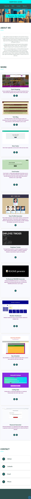

# Update Professional-Portfolio

## Apply Requirements :

* The Updated portfolio present :

  * My Bio;
  * Two projects and nine homeworks assignments;
  * Link to a downloadable PDF of my resume;
   * My contact information [GitHub ,LinkedIn , Email ,Phone].

* The Updated GitHub Profile has :

  * An avatar image;
  * Biography;
  * My Email address;
  * Link to my deployed portfolio;
  * Four pinned repositories which each of them has more than 20 commits.

* Resume Updated.

* LinkedIn Updated.

# Application's Mobile Screenshot Interface:

* Mobile screen :

# Links :

* The URL of the deployed application: https://meryem-ad.github.io/Professional-Portfolio/
* The URL of the GitHub repository: https://github.com/MERYEM-AD/Professional-Portfolio